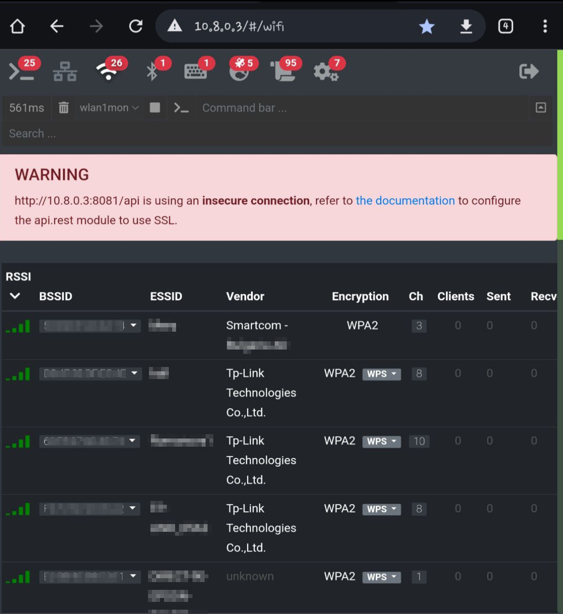

<p align="center">

# GhostRaven

The easiest Active Recon From the Air

<p align="center">
<p align="center">

<p align="center">

## Description

GhostRaven is a diy PCB board project that works like "remote hands" from the sky when it's on a drone. It uses 4G connection and OpenVPN to communicate with operator.
The primary tool is bettercap with web interface enabled, but it can use network tools such as responder,wifite,metasploit,NetExec and etc. The whole project is about 160 grams without drone.
The idea is to be used from two people, one for piloting the drone and one red teamer that have access to it using a VPN. Because of GPS module on bettercap the red team will always know where exactly is the drone.

[

## Overview
  
GhostRaven is an diy PCB board for aerial drone designed to perform wireless network penetration testing and cyber-security assessments from the sky.
Equipped with hacking tools and software, the GhostRaven Drone can identify vulnerabilities in wireless networks, gather data, and simulate attacks, making it an invaluable asset for security professionals and ethical hackers.
The drone can hold up to 20 min on the air and up to 1 hour if land somewhere.

#### Applications

+ Penetration Testing: Perform comprehensive security assessments on wireless networks.
+ Network Auditing: Identify and address potential security weaknesses.
+ Surveillance and Reconnaissance: Gather intelligence on network infrastructure.
+ Educational Purposes: Train cybersecurity professionals using real-world scenarios.

#### Benefits

+ Enhanced Security: Identifies and mitigates potential threats before they can be exploited.
+ Increased Efficiency: Covers large areas quickly, saving time and resources.    
+ Remote Locations: Drones can reach remote or inaccessible locations where manual penetration testing would be challenging or impossible.
+ High-Risk Areas: Safely assess networks in high-risk or hazardous areas without endangering personnel.
+ Low Visibility: Operate discreetly, avoiding detection and suspicion, making it ideal for covert operations.
+ Silent Operation: Many drones operate quietly, reducing the chance of alerting targets.
+ Wide Area Scanning: Cover large geographical areas quickly, providing comprehensive network assessments.
+ Efficient Mapping: Map extensive network infrastructures in a fraction of the time compared to ground-based methods.

#### Features

+ Wireless Network Scanning: Detects and analyzes available Wi-Fi networks.
+ Packet Sniffing: Captures and decodes data packets transmitted over networks.
+ Deauthentication Attacks: Disrupts connections between devices and access points.
+ Password Cracking: Attempts to crack Wi-Fi passwords using various algorithms.
+ Network Mapping: Creates a visual map of the network infrastructure.
+ Remote Control: Operates from a distance, providing real-time data and control.

### Software
#### Operating System selection

Official Raspberry pi x64 or Kali Pi edition (no desktop version)

note: if you are using official raspberry pi image you may also install another kali-arm repository on it.

#### Install Aircrack–ng suite
  
[Aircrack-ng](https://github.com/aircrack-ng/aircrack-ng) is a security software related to 802.11 standard wireless network analysis. Our tool relies on the Aircrack-ng suite for wireless network detection, capturing four-way handshake packets, and implementing a Wi-Fi deauthentication attack.
  
#### Install bettercap
```
sudo apt update
sudo apt install golang git build-essential libpcap-dev libusb-1.0-0-dev libnetfilter-queue-dev
git clone https://github.com/bettercap/bettercap.git
cd bettercap
make build
sudo make install
cd ..
git clone https://github.com/bettercap/caplets.git
cd caplets
sudo make install
```
#### Main script

copy start-main.sh file on /root directory and make sure to chmod +x on it.

Edit or create bettercap.service file:

```
sudo nano /etc/systemd/system/bettercap.service
```
```
[Unit]
Description=Bettercap Service
After=network.target

[Service]
ExecStart=/root/start-main.sh
WorkingDirectory=/root
StandardOutput=inherit
StandardError=inherit
Restart=always
User=root

[Install]
WantedBy=multi-user.target

```
Then type: 

```
sudo systemctl daemon-reload
sudo systemctl enable bettercap.service
```

### Enable Bluetooth Support
```
sudo apt install bluetooth pi-bluetooth bluez blueman
```
### Hardware

The Drone:

The drone that i use is fimi x8 se 2020, but u can use something simmiliar. The Hubson Zino 2 is a good choose also.

Part List:
1. 4G modem model: E3372h-153 with sim card internet enabled

2. Raspberry pi 4 4G or 8G version

3. Small USB Hub 4 in 1 (https://cdn.nedis.com/images/products_high_res/UHUBU2400BK_P10.JPG)

4. USB wifi Card Ralink rt2870 or something equivalent.

5. USB dongle CrazyRadio pa (https://www.bitcraze.io/products/crazyradio-pa/) 

6. 5 volt small fan 25mm

7. GPS USB dongle - U-blox7

8. MT3608 - 2A DC-DC Step Up (Boost) Power Module for power our rasppbery pi 4 (tunned on 5.2v if we use GPIO connectors)

9. TP 4056 USB Type C USB 5V 1A module to charge our battery or something similar

10. Battery li-lon 3000mah (it should be no more that the dimennsions of the raspberry pi 4
In my case the battery was glue to the bottom of the pi and then i glue the bottom of the plastic that holds velcro.

### Tips And tricks
The fan must be soldered directly to the battery otherwise the DC converter will not hold power and the pi will freeze.
To holdup rasp pi on the drone we can use velcro.

<p align="center">

### 3D Printing

In order to complete this project, you need to print files from STL directory. I was using PLA+ white color

### Soldering
For this project u have to know how to solder because you need to solder wires from USB hub to the USB modules and also you need to solder USB hub to one of the pi USB ports, in my case I use one of the USB 2.0.
You need to power your pi from GPIO and maybe use capacitor 1000uF 10v in order to have stable power supply. In my case, the voltage was must 5.2v in order to have stable connection with pi.

### The Remote server  
You need to make own VPN server wherever u prefer to make sure u have secure connection to your Raspberry Pi More information about client you can found on openvpnservice.txt file.

## Bettercap User interface from sky

<p align="center">


### Ethical Considerations

The use of GhostRaven Drone is strictly intended for ethical hacking and authorized security assessments. 
Unauthorized use of this technology for malicious purposes is illegal and unethical. 
Users must ensure compliance with all relevant laws and obtain necessary permissions before deploying the drone.


#### Contact Information

For more information, support, or inquiries, please contact:

    Email: flyaway999@proton.me
